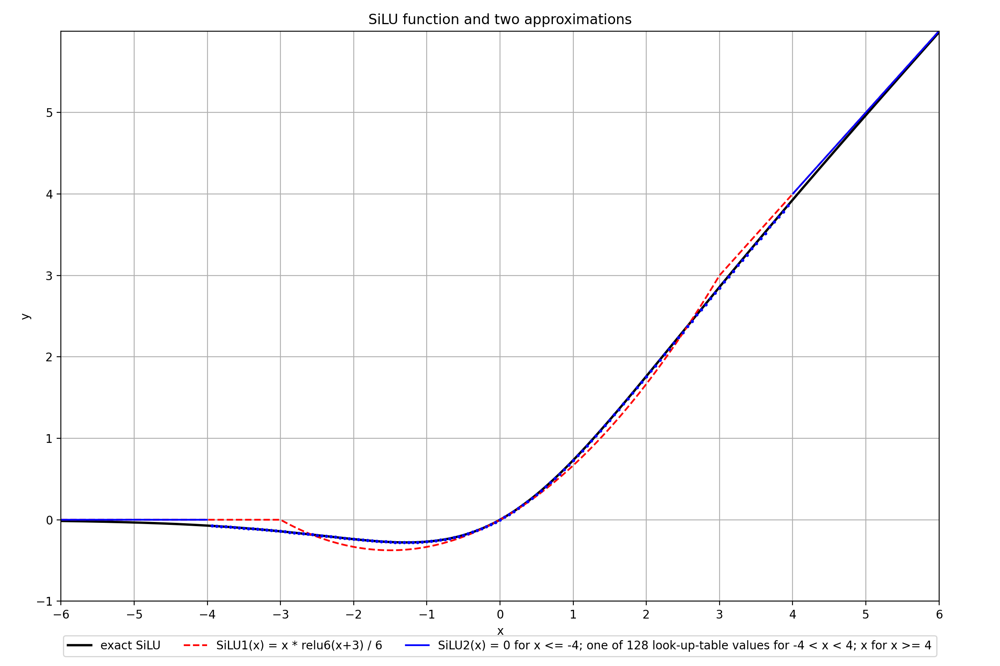
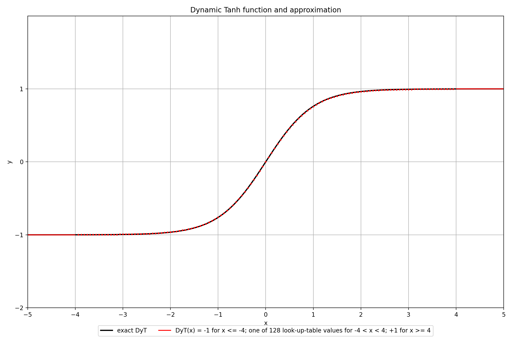

# Chisel activation functions
This repository contains hardware descriptions for the SiLU activation function. It also contains a replacement for LayerNorm called Dynamic Tanh. Finally it contains an implementation of GroupNorm called range GroupNorm. All three operations are found in ResNet and Transformer blocks in Diffusion models.
Analytically: `SiLU(x) = x / (1+exp(-x))` and `DyT(x) = tanh(α*x)` and `rangeGN(x_i) = (x_i - mean)/(alpha*range)`
In hardware however, these functions need to be approximated.

This repository contains two different hardware descriptions of the Sigmoid-Linear-Unit(SiLU) activation function, a hardware description of Dynamic Tanh as a normalization-replacement, and an approximation for GroupNorm called range GroupNorm. The inputs and outputs are all in BrainFloat16(BF16) format.

It makes use of the Chisel3 framework to describe, test and generate the hardware.
## SiLU 
### Visualization of SiLU and the two approximative versions

### Version 1
Version 1 is described in `src/main/scala/silu/silu.scala` and approximates the SiLU(x) function as `SiLU1(x) = x * ReLU6(x+3) / 6`.
For this an Adder and two Multipliers are needed. The Adder is pipelined and has 3 cycles latency, the two Multipliers each have 1 cycle latency, totaling 5 cycles latency for the SiLU approximation. The module can be pipelined however, to hide this latency.
(The Adder and Multiplier modules support BF16, floating point and double numbers. The SiLU module itself only supports BF16 numbers)

### Version 2
Version 2 is described in `src/main/scala/silu/siluUsingLUT.scala` and uses a piecewise function to approximate the SiLU function. Multiple flavours of this version exist however. The range where the lookup-table is used can be set to (-4, 4) or (-8, 8). The amount of entries in the lookup-table is configurable, where more entries correspond to more samplepoints per range, leading to a more detailed approximation. Entries in the lookup-table are chosen using an index, which consists of 1 signBit concatenated with intBits and fracBits. The four flavours are listed below:
| Function  | LUT Range      | LUT Entries | LUT index: (signBit; #intBits; #fracBits) |
|-----------|----------------|-------------|-------------------------------------------|
| SiLU2a(x) | -4 < x < 4     | 128         | (signbit; 2; 4)                           |
| SiLU2b(x) | -4 < x < 4     | 256         | (signbit; 2; 5)                           |
| SiLU2c(x) | -8 < x < 8     | 256         | (signbit; 3; 4)                           |
| SiLU2d(x) | -8 < x < 8     | 512         | (signbit; 3; 5)                           |

For x values below the LUT range the output is `SiLU2(x)=0`, for x values above the LUT range the output equals the input `SiLU2(x)=x`.

`siluUsingLUT.scala` has only 1 cycle latency for the SiLU approximation.

### Comparing the SiLU versions
For all versions a clock period of 5ns=5000ps is used, corresponding to a 200MHz frequency. Synthesized in TSMC 65nm, the wiring net area is neglected.
The mean squared error(MSE) is calculated using linearly spaced sample points in the range -10 to 10. It shows how well the approximation fits the exact SiLU function, where a lower MSE is better.

| Function  | MSE            | Cells | Area (um^2)      | Power (mW)   | Critical path delay (ps) | Scaled area 65nm->22nm (factor x0.2) (um^2) |
|-----------|----------------|-------|------------------|--------------|--------------------------|---------------------------------------------|
| SiLU1(x)  | 0.004861       | 629   | 1755.04          | 0.633941     | 2263                     | 351.01                                      |
| SiLU2a(x) | 0.0003603      | 358   | 599.48           | 0.114480     | 1002                     | 119.90                                      | 
| SiLU2b(x) | 0.0003519      | 582   | 924.00           | 0.133114     | 1214                     | 184.80                                      | 
| SiLU2c(x) | 0.0000949      | 579   | 908.040          | 0.132313     | 1048                     | 181.61                                      | 
| SiLU2d(x) | 0.0000938      | 979   | 1472.520         | 0.171142     | 1137                     | 294.50                                      | 

### Fitting the SiLU hardware module into the Gemmini accelerator platform
This SiLU unit must fit into the Gemmini accelerator platform. This means the SiLU approximation unit must be parallelized just like the systolic array in Gemmini. This means that for a systolic array of size 16 by 16, 16 SiLU hardware units in parallel are needed, to be able to apply 16 activation functions on 16 inputs in parallel. This ensures only single-cycle latencies are perceived when using the SiLU hardware units. Working with a 200MHz 16by16 systolic array configuration of Gemmini, 16 SiLU units are placed in parallel at the input of the scratchpad SRAM. This way the inputs can be activated with the SiLU function, before going into the systolic array. This puts a factor 16x on the area and power usage.

## Dynamic Tanh 
### Visualization of Dynamic Tanh and the approximative version

### Approximative function for dynamic tanh
The approximative function is described in `src/main/scala/silu/DyTUsingLUT.scala` and uses a piecewise function to approximate the DyT function.
- DyT(α*x) = -1  for x <= -4
- DyT(α*x) = one of the 128 entries in a lookup-table  for -4 < x < 4
- DyT(α*x) = +1  for x >= 4

DyTUsingLUT.scala has 3 cycles latency for the DyT approximation, but can work in a pipelined manner.

## range GroupNorm
### Visualization of GroupNorm and the approximation
TODO
### Approximative function for GroupNorm: rangeGN
The approximative function is described in `src/main/scala/GroupNorm/rangeGN.scala` and uses a simplified calculation to approximate the GroupNorm normalization function. `rangeGN(x_i) = (x_i - mean)/(alpha*range)`
with `alpha = 1/sqrt(2*ln(C/G))` and `mean = (1/(C/G)) *sum(x_k)`

## Chisel3 tests
Use `sbt test` to run all chisel3 tests. Running only the test for silu.scala can be done with `sbt 'testOnly silu.siluTest'`
Running only the test for siluUsingLUT.scala can be done with `sbt 'testOnly silu.siluUsingLUTTest'`
Running only the test for DyTUsingLUT.scala can be done with `sbt 'testOnly DyT.DyTUsingLUTTest'`
Use `sbt "testOnly hardfloat.DivSqrtRecFN_smallTest"` to run the test for the 16bit brainfloat division.
Use `sbt "testOnly GroupNorm.rangeGNTest"` to run the test for the range GroupNorm.

## Generate SystemVerilog RTL files
Use `sbt run` to generate all the systemverilog files (files ending on .sv). All files are saved into a new directory called `generated/`
## directory tree
```
chisel-silu
├── LICENSE
├── README.md
├── build.sbt
├── helpers
│   ├── generateSiluLUT.py
│   └── indices_silubf16.txt
├── project
│   └─ build.properties
└── src
    ├── main
    │   └── scala
    │        |── DyT
    |        |   └── DyTLUT.scala
    |        |
    │        |── GroupNorm
    |        |   └── rangeGN.scala
    |        |
    │        |── hardfloat
    |        |   ├── common.scala
    │        |   ├── DivSqrtRecFN_small.scala
    │        |   ├── FNFromRecFN.scala
    │        |   ├── primitives.scala
    │        |   ├── rawFloatFromFN.scala
    │        |   ├── rawFloatFromRecFN.scala
    │        |   ├── recFNFromFN.scala
    |        |   └── RoundAnyRawFNToRecFN.scala
    |        |  
    │        └── silu
    │            ├── BF16toFP.scala
    │            ├── FloatUtils.scala
    │            ├── FloatWrapper.scala
    │            ├── FPAdd.scala
    │            ├── FPMult.scala
    │            ├── relu6.scala
    │            ├── silu.scala
    |            ├── siluLUT.scala
    |            └── siluUsingLUT.scala
    |
    └── test
        └── scala
             |── DyT
             |   |── DyTLUTTest.scala
             |   └── DyTUsingLUTTest.scala
             |
             |── GroupNorm
             |   └── rangeGNTest.scala
             |
             |── hardfloat
             |   ├── DivSqrtRecFN_smallTest.scala
             |   |── package.scala
             |   ├── rawFloatFromFNWrapperTest.scala
             |   └── recFNFromFNWrapperTest.scala
             |  
             └── silu
                ├── BF16toFPTest.scala
                ├── FPAddTest.scala
                ├── FPMultTest.scala
                ├── relu6Test.scala
                ├── siluLUTTest.scala
                ├── siluTest.scala
                └── siluUsingLUTTest.scala
```
### Acknowledgements
Credits to https://github.com/zhemao/chisel-float/ for the floating point multiplier and adder. See LICENSE
Credits to https://github.com/ucb-bar/berkeley-hardfloat/ for the floating point divider unit. See LICENSE
