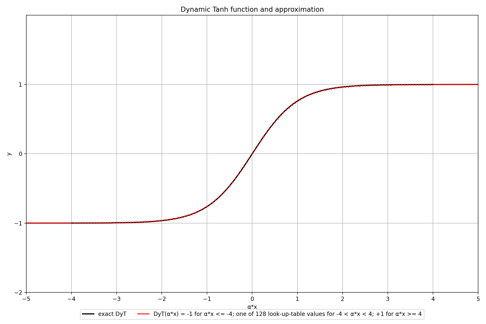

# Chisel activation functions
This repository contains hardware descriptions for the SiLU activation function and a replacement for LayerNorm called Dynamic Tanh. Both operations are found in ResNet and Transformer blocks in Diffusion models.
Analytically: `DyT(x) = tanh(α*x)` and `SiLU(x) = x / (1+exp(-x))`
In hardware however, these functions need to be approximated.

This repository contains two different hardware descriptions of the Sigmoid-Linear-Unit(SiLU) activation function, and a hardware description of Dynamic Tanh as a normalization-replacement. The inputs to the functions are all in BrainFloat16(BF16) format.

It makes use of the Chisel3 framework to describe, test and generate the hardware.
## SiLU 
### Visualization of SiLU and the two approximative versions

#### Version 1
Version 1 is described in `src/main/scala/silu/silu.scala` and approximates the SiLU(x) function as `SiLU1(x) = x * ReLU6(x+3) / 6`.
For this an Adder and two Multipliers are needed. The Adder is pipelined and has 3 cycles latency, the two Multipliers each have 1 cycle latency, totaling 5 cycles latency for the SiLU approximation. The module can be pipelined however, to hide this latency.
(The Adder and Multiplier modules support BF16, floating point and double numbers. The SiLU module itself only supports BF16 numbers)

#### Version 2
Version 2 is described in `src/main/scala/silu/siluUsingLUT.scala` and uses a piecewise function to approximate the SiLU function. Multiple flavours of this version exist however. The range where the lookup-table is used can be set to (-4, 4) or (-8, 8). The amount of entries in the lookup-table is configurable, where more entries correspond to more samplepoints per range, leading to a more detailed approximation. Entries in the lookup-table are chosen using an index, which consists of 1 signBit concatenated with intBits and fracBits. The four flavours are listed below:
| Function  | LUT Range      | LUT Entries | LUT index: (signBit; #intBits; #fracBits) |
|-----------|----------------|-------------|-------------------------------------------|
| SiLU2a(x) | -4 < x < 4     | 128         | (signbit; 2; 4)                           |
| SiLU2b(x) | -4 < x < 4     | 256         | (signbit; 2; 5)                           |
| SiLU2c(x) | -8 < x < 8     | 256         | (signbit; 3; 4)                           |
| SiLU2d(x) | -8 < x < 8     | 512         | (signbit; 3; 5)                           |

For x values below the LUT range the output is `SiLU2(x)=0`, for x values above the LUT range the output equals the input `SiLU2(x)=x`.

`siluUsingLUT.scala` has only 1 cycle latency for the SiLU approximation.

### Comparing the SiLU versions
For all versions a clock period of 5ns=5000ps is used, corresponding to a 200MHz frequency. Synthesized in TSMC 65nm, the wiring net area is neglected.
The mean squared error(MSE) is calculated using 193 linearly spaced sample points in the range -6 to 6. It shows how well the approximation fits the exact SiLU function, where a lower MSE is better.

| Function  | MSE            | Cells | Area (um^2)      | Power (mW)   | Critical path delay (ps) | Scaled area 65nm->22nm (factor x0.2) (um^2) |
|-----------|----------------|-------|------------------|--------------|--------------------------|---------------------------------------------|
| SiLU1(x)  | 0.004861       | 629   | 1755.04          | 0.633941     | 2263                     | 351.01                                      |
| SiLU2a(x) | 0.000579       | 358   | 599.48           | 0.114480     | 1002                     | 119.90                                      | 
| SiLU2b(x) | /              | 582   | 924.00           | 0.133114     | 1214                     | 184.80                                      | 
| SiLU2c(x) | /              | 579   | 908.040          | 0.132313     | 1048                     | 181.61                                      | 
| SiLU2d(x) | /              | 979   | 1472.520         | 0.171142     | 1137                     | 294.50                                      | 

#### Version 1: silu.scala
- Power: 6.33941e-04 Watt?
    - 59.61% in registers, 36.61% in logic, 3.79% in clock
    - 84.73% is internal, 15.18% is switching, 0.10% is leakage
- Timing path type: Register->Register
    - slack=2630ps(higher is better)
    - critical path delay=2263ps
#### Version 2: siluUsingLUT.scala
- SiLU2a(x) fitting accuracy:
    - Mean Squared Error(MSE): 0.000579
    - keep in mind this implementation uses a LUT with 128 entries to approximate SiLU for all BrainFloat16 inputs between -4 and +4.
- Power: 1.14480e-04 Watt?
    - 58.75% in registers, 38.08% in logic, 3.17% in clock
    - 79.67% is internal, 20.19% is switching, 0.15% is leakage
- Timing path type: Input->Register,
    - slack=3797ps(higher is better)
    - critical path delay=1002ps

===
- SiLU2b(x) fitting accuracy:
    - Mean Squared Error(MSE): ?
    - keep in mind this implementation uses a LUT with 256 entries to approximate SiLU for all BrainFloat16 inputs between -4 and +4.
- Power: ?
    - ?% in registers, ?% in logic, ?% in clock
    - ?% is internal, ?% is switching, ?% is leakage
- Timing path type: Input->Register,
    - slack=?ps(higher is better)
    - critical path delay=?ps

===
- SiLU2c(x) fitting accuracy:
    - Mean Squared Error(MSE): ?
    - keep in mind this implementation uses a LUT with 256 entries to approximate SiLU for all BrainFloat16 inputs between -8 and +8.
- Power: ?
    - ?% in registers, ?% in logic, ?% in clock
    - ?% is internal, ?% is switching, ?% is leakage
- Timing path type: Input->Register,
    - slack=?ps(higher is better)
    - critical path delay=?ps

===
- SiLU2d(x) fitting accuracy:
    - Mean Squared Error(MSE): ?
    - keep in mind this implementation uses a LUT with 512 entries to approximate SiLU for all BrainFloat16 inputs between -8 and +8.
- Power: ?
    - ?% in registers, ?% in logic, ?% in clock
    - ?% is internal, ?% is switching, ?% is leakage
- Timing path type: Input->Register,
    - slack=?ps(higher is better)
    - critical path delay=?ps

## Dynamic Tanh 
### Visualization of Dynamic Tanh and the approximative version

### Approximative function of dynamic tanh
The approximative function is described in `src/main/scala/silu/DyTUsingLUT.scala` and uses a piecewise function to approximate the DyT function.
- DyT(α*x) = -1  for x <= -4
- DyT(α*x) = one of the 128 entries in a lookup-table  for -4 < x < 4
- DyT(α*x) = +1  for x >= 4

DyTUsingLUT.scala has 3 cycles latency for the DyT approximation, but can work in a pipelined manner.

## Chisel3 tests
Use `sbt test` to run all chisel3 tests. Running only the test for silu.scala can be done with `sbt 'testOnly silu.siluTest'`
Running only the test for siluUsingLUT.scala can be done with `sbt 'testOnly silu.siluUsingLUTTest'`
Running only the test for DyTUsingLUT.scala can be done with `sbt 'testOnly DyT.DyTUsingLUTTest'`

## Generate SystemVerilog RTL files
Use `sbt run` to generate all the systemverilog files (files ending on .sv). All files are saved into a new directory called `generated/`
## directory tree
```
chisel-silu
├── LICENSE
├── README.md
├── build.sbt
├── helpers
│   ├── generateSiluLUT.py
│   └── indices_silubf16.txt
├── project
│   └─ build.properties
└── src
    ├── main
    │   └── scala
    │        └── silu
    |            ├── BF16toFP.scala
    │            ├── FPAdd.scala
    │            ├── FPMult.scala
    │            ├── FloatUtils.scala
    │            ├── FloatWrapper.scala
    │            ├── relu6.scala
    │            ├── silu.scala
    |            ├── siluLUT.scala
    |            └── siluUsingLUT.scala
    └── test
        └── scala
            └── silu
                ├── BF16toFPTest.scala
                ├── FPAddTest.scala
                ├── FPMultTest.scala
                ├── relu6Test.scala
                ├── siluLUTTest.scala
                ├── siluTest.scala
                └── siluUsingLUTTest.scala
```
### Acknowledgements
Credits to https://github.com/zhemao/chisel-float/ for the floating point multiplier and adder. See LICENSE
