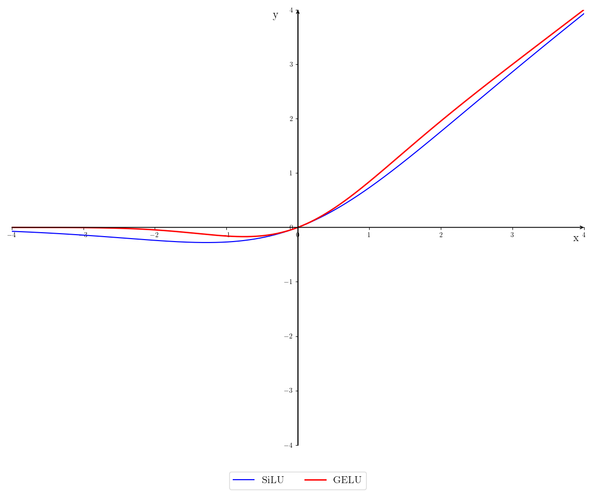
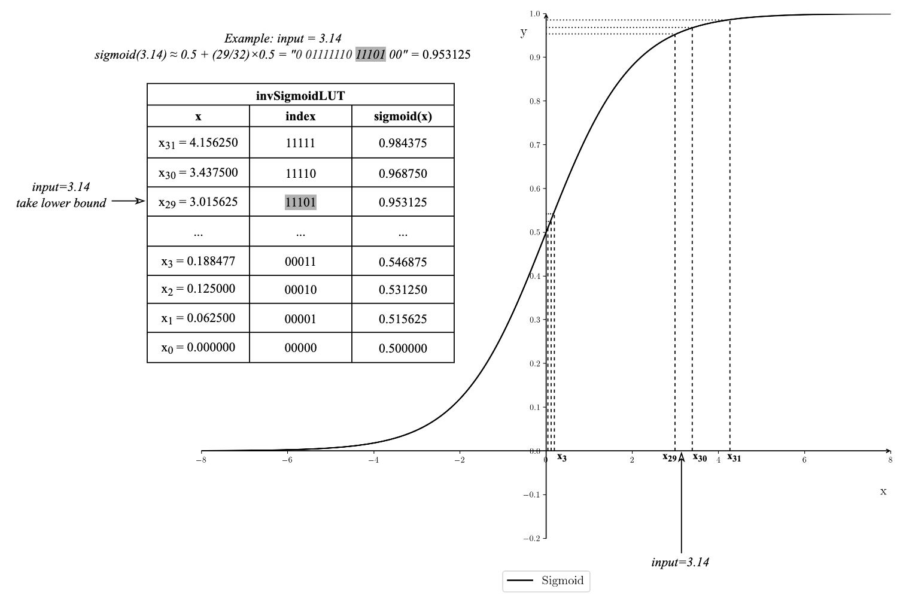

# Chisel activation functions
This repository contains hardware descriptions for activation and normalization functions used in Diffusion Models. The following functions are implemented in this repository: 
- SiLU (Sigmoid-Linear-Unit)
- GELU (Gausian-Error-Linear-Unit)
- GroupNorm 
- LayerNorm

In hardware however, these functions need to be approximated.
SiLU and GELU are approximated in three four ways: using a zero-order approximation using a (inverted) lookup-table (LUT) in the first two versions, an approximation function in the third version, and a first-order LUT in the fourth version.
The LayerNorm behavior is approximated using a Dynamic Tanh function: `DyT(x) = tanh(α*x)`, implemented as a zero-order approx.
For GroupNorm, the range GroupNorm approximation function is used: `rangeGN(x_i) = (x_i - mean)/(alpha*range)`.
All inputs and outputs are in BrainFloat16(BF16) format.

The Chisel framework is used to describe, test and generate all hardware, see the build.sbt file for the scala and chisel versions used.
This project uses the newer ChiselSim (EphemeralSimulator) and no longer relies on the old ChiselTest.

*Figure 1: Visualization of the two activation functions*

## SiLU 
The analytic function to approximate is `SiLU(x) = x / (1+exp(-x))`.

### SiLU Version 1
Version 1 is described in `src/main/scala/silu/siluUsingLUT.scala` and uses a lookup-table (LUT) that directly stores output values. Multiple flavours of this version exist however. The range where the LUT is used can be set to (-4, 4) or (-8, 8). The amount of entries in the LUT is configurable, where more entries correspond to more samplepoints per range, leading to a more detailed approximation. Entries in the LUT are chosen using an index. This index consists of 1 signBit concatenated with intBits and fracBits. The four flavours are listed below from least to most LUT entries.

| Function  | LUT Range      | LUT Entries | LUT index: (signBit; #intBits; #fracBits) |
|-----------|----------------|-------------|-------------------------------------------|
| SiLU1a(x) | -4 < x < 4     | 128         | (signbit; 2; 4)                           |
| SiLU1b(x) | -4 < x < 4     | 256         | (signbit; 2; 5)                           |
| SiLU1c(x) | -4 < x < 4     | 512         | (signbit; 2; 6)                           |
| SiLU1d(x) | -8 < x < 8     | 256         | (signbit; 3; 4)                           |
| SiLU1e(x) | -8 < x < 8     | 512         | (signbit; 3; 5)                           |
| SiLU1f(x) | -8 < x < 8     | 1024        | (signbit; 3; 6)                           |

For x values below the LUT range the output is `SiLU1(x)=0`, for x values above the LUT range the output equals the input `SiLU1(x)=x`.

`siluUsingLUT.scala` has only 1 cycle latency for the SiLU approximation.

### SiLU Version 2
Version 2 uses an inverted LUT method for the sigmoid function, to implement `SiLU2(x) = x * sigmoid(x)` in the range (-8,8). Outside that range, the output is clipped to 0 or x. The inverted LUT stores the inputs to the corresponding uniformly spaced sigmoid y-values between [0.5, 1.0]. This means the stored inputs are non-uniformly spaced.
The sigmoid can then be approximated using a linear interpolation of the index: `y = 0.5 +- (index/32)*0.5`, here using 32 entries. For inputs in the negative range (-8,0), we make use of the following property of sigmoid: `sigmoid(x) = 1-sigmoid(-x)`, which enables us to reuse the same LUT entries as for the positive range (0,8).
This implementation uses 5 comparators to find the index of the stored input closest to the incoming input. It also uses a BF16 multiplier to multiply the input with the sigmoid, and a BF16 subtractor for negative inputs. The subtractor is pipelined and has 3 cycles latency, the multiplier has one cycle latency, with two pipeline registers storing the index and the sigmoid, this totals 6 cycles latency for the SiLU approximation, but this latency is hidden thanks to the pipeline registers.

| Function       | inverse Sigmoid LUT Range | LUT Entries |
|----------------|---------------------------|-------------|
| InvSigmoida(y) | 0.5 < y < 1.0             | 32          |
| InvSigmoidb(y) | 0.5 < y < 1.0             | 64          |
| InvSigmoidc(y) | 0.5 < y < 1.0             | 128         |

*Figure 2: Diagram of the sigmoid for SiLU version 2*

### SiLU Version 3
Version 3 is described in `src/main/scala/silu/hsilugelu.scala` and uses h-SiLU to approximate the SiLU(x) function: `SiLU3(x) = x * ReLU6(x+3) / 6`.

*Figure 3: Diagram of SiLU version 3*

This approximation uses a BF16 Adder and two Multipliers. The Adder is pipelined and has 3 cycles latency, the two Multipliers each have 1 cycle latency, totaling 5 cycles latency for the SiLU approximation. The module can be pipelined however, to hide this latency.

### SiLU Version 4
Version 4 first uses a first-order approx. using 20 segments for the sigmoid function, to then multiply with the input to obtain SiLU. Described in `siluandgeluPWLSigmoid20NonUniformSegments.scala`

### Comparing the SiLU versions
For all versions a clock period of 5ns=5000ps is used, corresponding to a 200MHz frequency. Synthesized in TSMC 65nm, the wiring net area is neglected.
The mean squared error(MSE) is calculated using 100 uniformly spaced sample points in the range -8 to 8. It shows how well the approximation fits the exact SiLU function, where a lower MSE is better.

| Function  | MSE            | Cells | Area (um^2)      | Power (mW)   | Critical path delay (ps) |
|-----------|----------------|-------|------------------|--------------|--------------------------|
| SiLU1a(x) | 6.90e-4        | 357   | 581.00           | 0.090799     | 991                      |
| SiLU1b(x) | 4.79e-4        | 593   | 912.80           | 0.117809     | 1027                     |
| SiLU1c(x) | 4.36e-4        | 933   | 1388.24          | 0.144966     | 1266                     | 
| SiLU1d(x) | 3.94e-4        | 589   | 903.28           | 0.117763     | 1015                     | 
| SiLU1e(x) | 6.81e-5        | 939   | 1398.04          | 0.144768     | 1012                     | 
| SiLU1f(x) | 2.51e-5        | 1279  | 1912.12          | 0.180970     | 1366                     | 
| SiLU2a(x) | 3.52e-3        | 627   | 1495.48          | 0.497005     | 1647                     | 
| SiLU2b(x) | 7.97e-4        | 746   | 1722.56          | 0.575143     | 1788                     |
| SiLU2c(x) | 4.50e-4        | 886   | 1956.64          | 0.599856     | 1875                     |
| SiLU3(x)  | 4.86e-3        | 602   | 1758.40          | 0.620901     | 2196                     |

## GELU
The analytic function to approximate is `GELU(x) = x*0.5*[1+erf(x/sqrt(2))]`.

### GELU version 1
The hardware implementation is described in `src/main/scala/gelu/geluUsingLUT.scala` and uses a piecewise function to approximate the GELU function. Multiple flavours of this version exist however. The range where the lookup-table is used can be set to (-4, 4) or (-8, 8). The amount of entries in the lookup-table is configurable, where more entries correspond to more samplepoints per range, leading to a more detailed approximation. Entries in the lookup-table are chosen using an index. This index consists of 1 signBit concatenated with intBits and fracBits. The four flavours are listed below from least to most LUT entries.

| Function  | LUT Range      | LUT Entries | LUT index: (signBit; #intBits; #fracBits) |
|-----------|----------------|-------------|-------------------------------------------|
| GELU1a(x) | -4 < x < 4     | 128         | (signbit; 2; 4)                           |
| GELU1b(x) | -4 < x < 4     | 256         | (signbit; 2; 5)                           |
| GELU1c(x) | -4 < x < 4     | 512         | (signbit; 2; 6)                           |
| GELU1d(x) | -8 < x < 8     | 256         | (signbit; 3; 4)                           |
| GELU1e(x) | -8 < x < 8     | 512         | (signbit; 3; 5)                           |
| GELU1f(x) | -8 < x < 8     | 1024        | (signbit; 3; 6)                           |

For x values below the LUT range the output is `GELU(x)=0`, for x values above the LUT range the output equals the input `GELU(x)=x`.

`geluUsingLUT.scala` has only 1 cycle latency for the GELU approximation.

### GELU Version 2
Version 2 uses an inverted LUT method for the sigmoid function, just like in SiLU version 2. However the sigmoid is now used to implement `GELU2(x) = x * sigmoid(1.702*x)` in the range (-8,8). Outside that range, the output is clipped to 0 or x. The inverted LUT stores the inputs to the corresponding uniformly spaced sigmoid y-values between [0.5, 1.0]. This means the stored inputs are non-uniformly spaced.
The sigmoid can then be approximated using a linear interpolation of the index: `y = 0.5 +- (index/32)*0.5`, here using 32 entries. For inputs in the negative range (-8,0), we make use of the following property of sigmoid: `sigmoid(x) = 1-sigmoid(-x)`, which enables us to reuse the same LUT entries as for the positive range (0,8).
This implementation uses 5 comparators to find the index of the stored input closest to the incoming input. It also uses a BF16 multiplier to multiply the input with the sigmoid, another BF16 multiplier to multiply 1.702 with the input, and a BF16 subtractor for negative inputs. The subtractor is pipelined and has three cycles latency, the multipliers each have one cycle latency, with two pipeline registers storing the index and the sigmoid, this totals 7 cycles latency for the GELU approximation, but this latency is hidden thanks to the pipeline registers.

| Function       | inverse Sigmoid LUT Range | LUT Entries |
|----------------|---------------------------|-------------|
| InvSigmoida(y) | 0.5 < y < 1.0             | 32          |
| InvSigmoidb(y) | 0.5 < y < 1.0             | 64          |
| InvSigmoidc(y) | 0.5 < y < 1.0             | 128         |

### GELU Version 3
This version is h-GELU, the hardware of h-SiLU is reused, just a multiplication with factor 1.702 is added to approximate GELU.

### GELU Version 4
Version 4 first again uses a first-order approx. using 20 segments for the sigmoid function, reusing the hardware of SiLU version 4, to then multiply with the input to obtain GELU. Just a multiplication with factor 1.702 is added to approximate GELU. Described in `siluandgeluPWLSigmoid20NonUniformSegments.scala`

### Comparing the GELU versions
For all versions a clock period of 5ns=5000ps is used, corresponding to a 200MHz frequency. Synthesized in TSMC 65nm, the wiring net area is neglected.
The mean squared error(MSE) is calculated using 100 random sample points in the range -8 to 8. It shows how well the approximation fits the exact GELU function, where a lower MSE is better.

| Function  | MSE        | Cells | Area (um^2) | Power (mW) | Critical path delay (ps) |
|-----------|------------|-------|-------------|------------|--------------------------|
| GELU1a(x) | 2.70e-4    | 401   | 642.04      | 0.101190   | 1068                     |
| GELU1b(x) | 4.99e-5    | 620   | 946.68      | 0.125680   | 1086                     |
| GELU1c(x) | 8.31e-6    | 899   | 1371.16     | 0.149521   | 1194                     |
| GELU1d(x) | 3.97e-4    | 522   | 796.60      | 0.111748   | 1058                     |
| GELU1e(x) | 4.99e-5    | 788   | 1204.28     | 0.140249   | 1024                     |
| GELU1f(x) | 8.31e-6    | 1120  | 1695.68     | 0.175198   | 1287                     |
| GELU2a(x) | 1.03e-3    | 627   | 1495.48     | 0.497005   | 1647                     |
| GELU2b(x) | 3.38e-4    | 746   | 1722.56     | 0.575143   | 1788                     |
| GELU2c(x) | 2.76e-4    | 886   | 1956.64     | 0.599856   | 1875                     |

The area for GELU2a/b/c and SiLU3a/b/c is shared since they use the same inverted Sigmoid LUT.

## LayerNorm 
The exact LayerNorm is defined as `LayerNorm(x) = (x_i - mean)/(sqrt(variance))`. The mean and variance here need to be calculated along all channels for each (x,y) coordinate. Since this requires three passes over all channels to normalize all the elements/channels along a (x,y) coordinate, it is very time-consuming operation. As a simpler solution, we will approximate the normalization of each element with a dynamic hyperbolic tangent function instead.

### Approximative function for dynamic tanh
The approximative function is described in `src/main/scala/DyT/DyTUsingLUT.scala` and uses a piecewise function to approximate the DyT function.
- DyT(α*x) = -1  for x <= -4
- DyT(α*x) = one of the 128 entries in a lookup-table  for -4 < x < 4
- DyT(α*x) = +1  for x >= 4

DyTUsingLUT.scala has 3 cycles latency for the DyT approximation, but can work in a pipelined manner.

### Multiple Dynamic Tanh versions
Multiple flavours of this version exist however. The range where the lookup-table is used can be set to (-4, 4) or (-8, 8). The amount of entries in the lookup-table is configurable, where more entries correspond to more samplepoints per range, leading to a more detailed approximation. Entries in the lookup-table are chosen using an index. This index consists of 1 signBit concatenated with intBits and fracBits. The four flavours are listed below from least to most LUT entries.

| Function   | LUT Range      | LUT Entries | LUT index: (signBit; #intBits; #fracBits) |
|------------|----------------|-------------|-------------------------------------------|
| DyT1a(x)   | -4 < x < 4     | 128         | (signbit; 2; 4)                           |
| DyT1b(x)   | -4 < x < 4     | 256         | (signbit; 2; 5)                           |
| DyT1c(x)   | -4 < x < 4     | 512         | (signbit; 2; 6)                           |
| DyT1d(x)   | -8 < x < 8     | 256         | (signbit; 3; 4)                           |
| DyT1e(x)   | -8 < x < 8     | 512         | (signbit; 3; 5)                           |
| DyT1f(x)   | -8 < x < 8     | 1024        | (signbit; 3; 6)                           |

### Comparing the Dynamic Tanh versions
For all versions a clock period of 5ns=5000ps is used, corresponding to a 200MHz frequency. Synthesized in TSMC 65nm, the wiring net area is neglected.
The mean squared error(MSE) of every approximation versus the exact dynamic tanh function is calculated using 100 random sample points in the range -8 to 8. It shows how well the approximation fits the exact dynamic tanh function, where a lower MSE is better.

| Function  | MSE           | Cells | Area (um^2)      | Power (mW)   | Critical path delay (ps) |
|-----------|---------------|-------|------------------|--------------|--------------------------|
| Dyt1a(x)  | 3.72e-4       | 428   | 1069.60          | 0.355952     | 1112                     |
| DyT1b(x)  | 7.56e-5       | 497   | 1172.08          | 0.387214     | 1112                     |
| DyT1c(x)  | 2.63e-5       | 597   | 1296.96          | 0.401081     | 1114                     |
| DyT1d(x)  | 2.93e-4       | 464   | 1120.00          | 0.385373     | 1114                     |
| DyT1e(x)  | 8.13e-5       | 523   | 1212.96          | 0.404407     | 1112                     |
| DyT1f(x)  | 9.24e-5       | 601   | 1309.28          | 0.424083     | 1114                     |

### Fitting the Dynamic Tanh hardware module into the Gemmini accelerator platform
The dynamic hyperbolic tangent function replaces the LayerNorm normalization. Instead of requiring multiple passes across the channel dimension, a single application of the dynamic tanh activation is used. Each spatial element (height and width) has its own alpha factor, which is shared across the channels, approximating the LayerNorm. Since the module takes both alpha and the tensor's element as inputs, we can just place 16 DyT modules in parallel to match the systolic array bandwidth.

## range GroupNorm
The exact GroupNorm is defined as `GroupNorm(x_i) = (x_i - mean)/(sqrt(variance))`. The mean and variance here are calculated along the channels per group only, making it more feasible than LayerNorm. However we will approximate the variance to simplify the computation.

*Figure 4: Simple example of GroupNorm for 12 channels and 4 groups*

### Approximative function for GroupNorm: rangeGN
The approximative function is described in `src/main/scala/GroupNorm/rangeGN.scala` and uses a simplified calculation to approximate the GroupNorm normalization function. `rangeGN(x_i) = (x_i - mean)/(alpha*range)`
with `alpha = 1/sqrt(2*ln(C/G))`, `mean = (1/(C/G)) *sum(x_k)` and `range = max() - min()`

The latency of `rangeGN.scala` depends on the number of elements per group. The GroupNorm in the UNET of Stable Diffusion 1.5 uses 32 groups (G) and the number of channels (C) can be 320, 640 or 1280. This means there are respectively 10, 20 or 40 elements per group. The amount of elements per group impacts the adder tree's depth for the mean calculation. The total latency ranges from 29 clock cycles to 31 to 39 respectively.

### Diagram of range GroupNorm

*Figure 5: Diagram of range GroupNorm*

This approximation's critical path uses an adder tree, a multiplier with 1/m, a subtractor, a divider and another final multiplier, totaling a latency of of 30 clock cycles. The module can be pipelined however, to hide the latency.

### rangeGN results
A clock period of 5ns=5000ps is used, corresponding to a 200MHz frequency. Synthesized in TSMC 65nm, the wiring net area is neglected.
TODO: The mean squared error(MSE) of range GroupNorm versus the classic GroupNorm is calculated using linearly spaced sample points in the range -10 to 10. It shows how well the approximation fits the classic GroupNorm, where a lower MSE is better.

| Function        | UNET level | m  | Cells | Area (um^2)  | Power (mW) | critical path delay (ps) |
|-----------------|------------|----|-------|--------------|------------|--------------------------|
| rangeGN320C(x)  | 0          | 10 | 14191 | 32875.92     | 14.9033    | 4792                     |            
| rangeGN640C(x)  | 1          | 20 | 31053 | 70198.24     | 32.7568    | 4792                     |
| rangeGN1280C(x) | 2&3        | 40 | 68824 | 152923.96    | 69.2825    | 5519                     |

## Chisel tests
Use `sbt test` to run all chisel tests. Running only the test for silu.scala for example can be done with `sbt 'testOnly silu.siluTest'`
Running only the test for siluUsingLUT.scala can be done with `sbt 'testOnly silu.siluUsingLUTTest'`
Running only the test for DyTUsingLUT.scala can be done with `sbt 'testOnly DyT.DyTUsingLUTTest'`
Use `sbt "testOnly silu.siluandgeluPWLSigmoidTest"` to run the test for the first-order approx of SiLU and GELU
Use `sbt "testOnly hardfloat.DivSqrtRecFN_smallTest"` to run the test for the 16bit brainfloat division.
Use `sbt "testOnly GroupNorm.rangeGNTest"` to run the test for the range GroupNorm.

## Generate SystemVerilog RTL files
Use `sbt run` to generate systemverilog files (files ending on .sv). Terminal will ask what file is toplevel (if multiple files have the ChiselStage.emitSystemVerilogFile uncommented). Generated files are saved into `generated/`

### Acknowledgements
Credits to https://github.com/zhemao/chisel-float/ for the floating point multiplier and adder. See LICENSE
Credits to https://github.com/ucb-bar/berkeley-hardfloat/ for the floating point divider unit. See LICENSE
