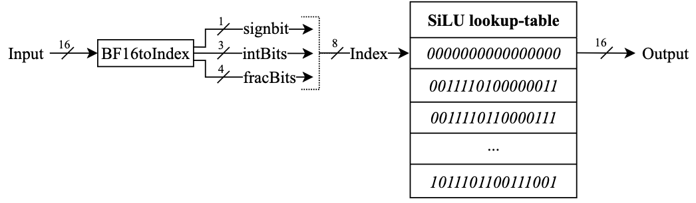
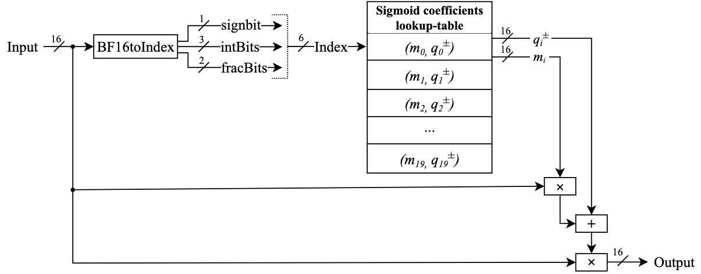
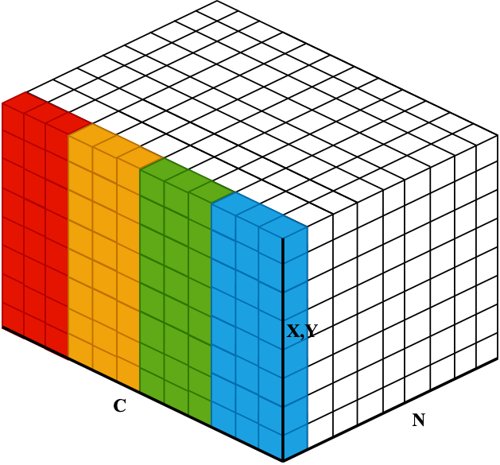
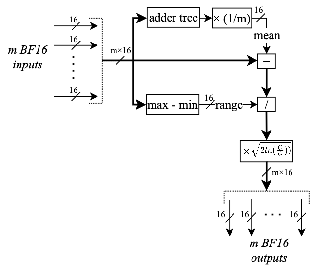

# Chisel activation functions
This repository contains hardware descriptions for activation and normalization functions used in Diffusion Models. The following functions are implemented in this repository: 
- SiLU (Sigmoid-Linear-Unit)
- GELU (Gausian-Error-Linear-Unit)
- GroupNorm 
- LayerNorm (using tanh())

In hardware however, these functions need to be approximated.
SiLU and GELU are approximated in three four ways: using a zero-order approximation using a (inverted) lookup-table (LUT) in the first two versions, an approximation function in the third version, and a first-order approx. of sigmoid in the fourth version.
The LayerNorm behavior is approximated using a Dynamic Tanh function: `DyT(x) = tanh(α*x)`, implemented as a zero-order approx.
For GroupNorm, the range GroupNorm approximation function is used: `rangeGN(x_i) = (x_i - mean)/(alpha*range)`.
All inputs and outputs are in BrainFloat16(BF16) format.

The Chisel framework is used to describe, test and generate all hardware, see the `build.sbt` file for the scala and chisel versions.

This project uses the newer ChiselSim (EphemeralSimulator) and no longer relies on ChiselTest (https://www.chisel-lang.org/docs/appendix/migrating-from-chiseltest).

*Figure 1: Visualization of the two activation functions*

## SiLU 
The analytic function to approximate is `SiLU(x) = x / (1+exp(-x))`.

### SiLU Version 1
Version 1 is described in `src/main/scala/silu/siluUsingLUT.scala` and uses a lookup-table (LUT) that directly stores output values, so a zero-order approximation is used. Multiple variants of this version exist however: since the range where the LUT is used can be set to (-4, 4) or (-8, 8) and the amount of entries in the LUT is configurable, where more entries correspond to more samplepoints per range, leading to a more detailed approximation. Entries in the LUT are chosen using an index. This index consists of 1 signBit concatenated with intBits and fracBits. The four flavours are listed below from least to most LUT entries.

| Function  | LUT Range      | LUT Entries | LUT index: (signBit; #intBits; #fracBits) |
|-----------|----------------|-------------|-------------------------------------------|
| SiLU1a(x) | -4 < x < 4     | 128         | (signbit; 2; 4)                           |
| SiLU1b(x) | -4 < x < 4     | 256         | (signbit; 2; 5)                           |
| SiLU1c(x) | -4 < x < 4     | 512         | (signbit; 2; 6)                           |
| SiLU1d(x) | -8 < x < 8     | 256         | (signbit; 3; 4)                           |
| SiLU1e(x) | -8 < x < 8     | 512         | (signbit; 3; 5)                           |
| SiLU1f(x) | -8 < x < 8     | 1024        | (signbit; 3; 6)                           |

For x values below the LUT range the output is `SiLU1(x)=0`, for x values above the LUT range the output equals the input `SiLU1(x)=x`.

*Figure 2: Hardware diagram of the zero-order SiLU version 1*

`siluUsingLUT.scala` has only 1 cycle latency for the SiLU approximation.

### SiLU Version 2
Version 2 uses an inverted LUT method for the sigmoid function, to implement `SiLU2(x) = x * sigmoid(x)` in the range (-8,8). Outside that range, the output is clipped to 0 or x. The inverted LUT stores the inputs to the corresponding uniformly spaced sigmoid y-values between [0.5, 1.0]. This means the stored inputs are non-uniformly spaced.
The sigmoid can then be approximated using a linear interpolation of the index: `y = 0.5 +- (index/32)*0.5`, here using 32 entries. For inputs in the negative range (-8,0), we make use of the following property of sigmoid: `sigmoid(x) = 1-sigmoid(-x)`, which enables us to reuse the same LUT entries as for the positive range (0,8).
This implementation uses 5 comparators to find the index of the stored input closest to the incoming input. It also uses a BF16 multiplier to multiply the input with the sigmoid, and a BF16 subtractor for negative inputs. The subtractor is pipelined and has 3 cycles latency, the multiplier has one cycle latency, with two pipeline registers storing the index and the sigmoid, this totals 6 cycles latency for the SiLU approximation, but this latency is hidden thanks to the pipeline registers.

| Function       | inverse Sigmoid LUT Range | LUT Entries |
|----------------|---------------------------|-------------|
| InvSigmoida(y) | 0.5 < y < 1.0             | 32          |
| InvSigmoidb(y) | 0.5 < y < 1.0             | 64          |
| InvSigmoidc(y) | 0.5 < y < 1.0             | 128         |

*Figure 3: Diagram of the zero-order sigmoid for SiLU version 2*

### SiLU Version 3
Version 3 is described in `src/main/scala/silu/hsilugelu.scala` and uses h-SiLU to approximate the SiLU(x) function: `SiLU3(x) = x * ReLU6(x+3) / 6`.

*Figure 4: Diagram of SiLU version 3*

This approximation uses a BF16 Adder and two Multipliers. The Adder is pipelined and has 3 cycles latency, the two Multipliers each have 1 cycle latency, totaling 5 cycles latency for the SiLU approximation. The module can be pipelined however, to hide this latency.

### SiLU Version 4
Version 4 first uses a first-order approx. using 20 segments for the sigmoid function, to then multiply with the input to obtain SiLU. Described in `siluandgeluPWLSigmoid20NonUniformSegments.scala`

*Figure 5: Diagram of SiLU version 4 using first-order-approximated sigmoid *

## GELU
The analytic function to approximate is `GELU(x) = x*0.5*[1+erf(x/sqrt(2))]`.

### GELU version 1
The hardware implementation is described in `src/main/scala/gelu/geluUsingLUT.scala` and uses a piecewise function to approximate the GELU function. Multiple flavours of this version exist however. The range where the lookup-table is used can be set to (-4, 4) or (-8, 8). The amount of entries in the lookup-table is configurable, where more entries correspond to more samplepoints per range, leading to a more detailed approximation. Entries in the lookup-table are chosen using an index. This index consists of 1 signBit concatenated with intBits and fracBits. The four flavours are listed below from least to most LUT entries.

| Function  | LUT Range      | LUT Entries | LUT index: (signBit; #intBits; #fracBits) |
|-----------|----------------|-------------|-------------------------------------------|
| GELU1a(x) | -4 < x < 4     | 128         | (signbit; 2; 4)                           |
| GELU1b(x) | -4 < x < 4     | 256         | (signbit; 2; 5)                           |
| GELU1c(x) | -4 < x < 4     | 512         | (signbit; 2; 6)                           |
| GELU1d(x) | -8 < x < 8     | 256         | (signbit; 3; 4)                           |
| GELU1e(x) | -8 < x < 8     | 512         | (signbit; 3; 5)                           |
| GELU1f(x) | -8 < x < 8     | 1024        | (signbit; 3; 6)                           |

For x values below the LUT range the output is `GELU(x)=0`, for x values above the LUT range the output equals the input `GELU(x)=x`.

`geluUsingLUT.scala` has only 1 cycle latency for the GELU approximation.

### GELU Version 2
Version 2 reuses the inverted LUT method for the sigmoid function from SiLU version 2. However the sigmoid is now used to implement `GELU2(x) = x * sigmoid(1.702*x)`, so an additional multiplication with 1.702 is the only difference.

### GELU Version 3
This version is h-GELU, which reuses the hardware of h-SiLU, but adds a multiplication with factor 1.702 to approximate GELU.

### GELU Version 4
Version 4 reuses the first-order approximation in 20 segments for the sigmoid function from SiLU version 4. A multiplication with factor 1.702 is now added to approximate GELU. Described in `siluandgeluPWLSigmoid20NonUniformSegments.scala`

The modules for GELU2a/b/c and SiLU2a/b/c are shared since they use the same inverted Sigmoid LUT. Similar reuse happens for GELU3 and SiLU3 and for SiLU4a/b with GELU4a/b.

## LayerNorm 
The exact LayerNorm is defined as `LayerNorm(x) = (x_i - mean)/(sqrt(variance))`. The mean and variance here need to be calculated along all channels for each (x,y) coordinate. Since this requires three passes over all channels to normalize all the elements/channels along a (x,y) coordinate, it is very time-consuming operation. As a simpler solution, we will approximate the normalization of each element with a dynamic hyperbolic tangent function instead.

### Approximative function for dynamic tanh
The approximative function is described in `src/main/scala/DyT/DyTUsingLUT.scala` and uses a piecewise function to approximate the DyT function.
- DyT(α*x) = -1  for x <= -4
- DyT(α*x) = one of the 128 entries in a lookup-table  for -4 < x < 4
- DyT(α*x) = +1  for x >= 4

DyTUsingLUT.scala has 3 cycles latency for the DyT approximation, but can work in a pipelined manner.

### Multiple Dynamic Tanh versions
Multiple variants of this version again exist: the range where the lookup-table is used and the amount of entries in the lookup-table is configurable, where more entries correspond to more samplepoints per range, leading to a more detailed approximation.

## range GroupNorm
The exact GroupNorm is defined as `GroupNorm(x_i) = (x_i - mean)/(sqrt(variance))`. The mean and variance here are calculated along the channels per group only, making it more feasible than LayerNorm. However we will approximate the variance to simplify the computation.

*Figure 6: Simple example of GroupNorm for 12 channels and 4 groups*

### Approximative function for GroupNorm: rangeGN
The approximative function is described in `src/main/scala/GroupNorm/rangeGN.scala` and uses a simplified calculation to approximate the GroupNorm normalization function. `rangeGN(x_i) = (x_i - mean)/(alpha*range)`
with `alpha = 1/sqrt(2*ln(C/G))`, `mean = (1/(C/G)) *sum(x_k)` and `range = max() - min()`

The latency of `rangeGN.scala` depends on the number of elements per group. The GroupNorm in the UNET of Stable Diffusion 1.5 uses 32 groups (G) and the number of channels (C) can be 320, 640 or 1280. This means there are respectively 10, 20 or 40 elements per group. The amount of elements per group impacts the adder tree's depth for the mean calculation. The total latency ranges from 29 clock cycles to 31 to 39 respectively.

### Diagram of range GroupNorm

*Figure 7: Diagram of range GroupNorm*

This approximation's latency is set by an adder tree, a multiplier with 1/m, a subtractor, a divider and another final multiplier, totaling a latency of of 30 clock cycles. The module can be pipelined however, to hide the latency.

## Chisel tests
Use `sbt test` to run all tests, using ChiselSim's EphemeralSimulator.

Tests can also be run individually, below are a few examples:

- Run test for h-SiLU and h-GELU: `sbt 'testOnly silu.hsilugeluTest'`
- Run test for siluUsingLUT.scala: `sbt 'testOnly silu.siluUsingLUTTest'`
- Run test for DyTUsingLUT.scala: `sbt 'testOnly DyT.DyTUsingLUTTest'`
- Run test for the first-order approx of SiLU and GELU `sbt 'testOnly silu.siluandgeluPWLSigmoidTest'` 
- Run test for rangeGN: `sbt 'testOnly GroupNorm.rangeGNTest'`

## Generate SystemVerilog RTL files
Use `sbt run` to generate systemverilog files. Terminal will ask what file is toplevel if multiple files have `ChiselStage.emitSystemVerilogFile` uncommented. Generated files are saved into `generated/`

If `sbt run` gives errors saying "no Main Class detected", try to directly run the generation for a particular module e.g.:
- `sbt 'runMain GroupNorm.rangeGNMain'`
- `sbt 'runMain toplevel.toplevelMain'` 

### Acknowledgements
Credits to https://github.com/zhemao/chisel-float/ for the floating point multiplier and adder. See LICENSE
Credits to https://github.com/ucb-bar/berkeley-hardfloat/ for the floating point divider unit. See LICENSE
